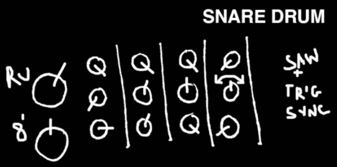
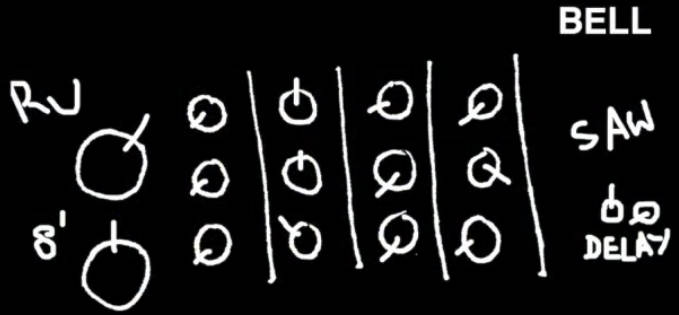
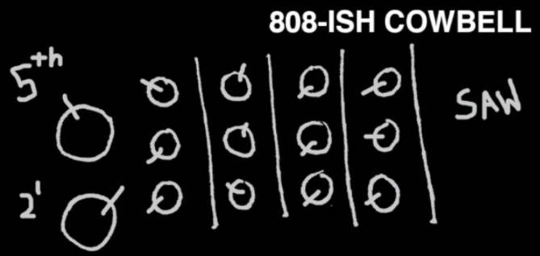
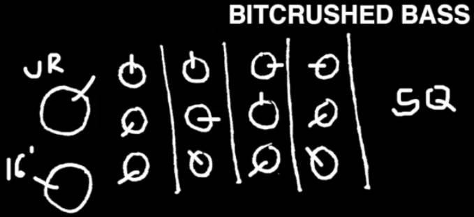
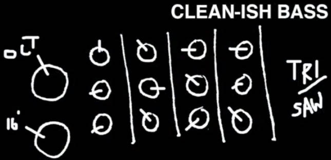
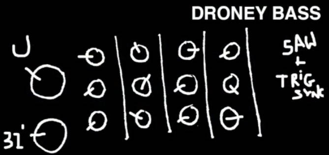
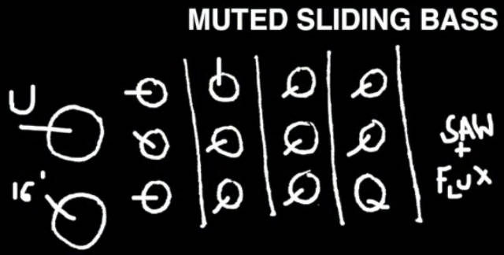
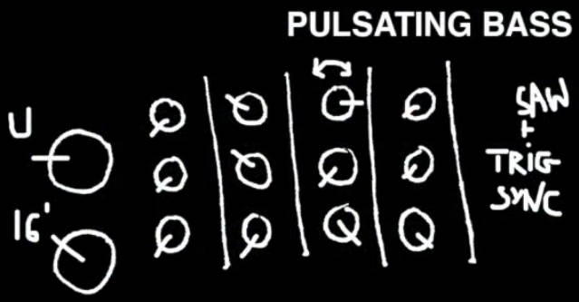

# Korg Volca Keys Patches

## Percussion and Bass patches

<iframe width="560" height="315" src="https://www.youtube.com/embed/wgIxv5HrtvA" frameborder="0" allow="accelerometer; autoplay; encrypted-media; gyroscope; picture-in-picture" allowfullscreen></iframe>

## EXTREMELY FAT PATCH

<iframe width="560" height="315" src="https://www.youtube.com/embed/hY1qX1sH0Rg" frameborder="0" allow="accelerometer; autoplay; encrypted-media; gyroscope; picture-in-picture" allowfullscreen></iframe>

## "Hoover" by LIQUID LIMBS

<iframe width="560" height="315" src="https://www.youtube.com/embed/BVCwgvFaUdc" frameborder="0" allow="accelerometer; autoplay; encrypted-media; gyroscope; picture-in-picture" allowfullscreen></iframe>

## 80's Style Synth Brass Lead Tutorial Synthwave

<iframe width="560" height="315" src="https://www.youtube.com/embed/m578sapIa7k" frameborder="0" allow="accelerometer; autoplay; encrypted-media; gyroscope; picture-in-picture" allowfullscreen></iframe>

## Organ-ish Korg Volca Keys

<iframe width="560" height="315" src="https://www.youtube.com/embed/0Sqzywl6T98" frameborder="0" allow="accelerometer; autoplay; encrypted-media; gyroscope; picture-in-picture" allowfullscreen></iframe>

## Synth-kick with the Volca Keys

<iframe width="560" height="315" src="https://www.youtube.com/embed/n9uecoQ7f_Y" frameborder="0" allow="accelerometer; autoplay; encrypted-media; gyroscope; picture-in-picture" allowfullscreen></iframe>

* Voice: Fifth/32
* VCO: Detune: 10h / Port: 0 / EG: 8h
* VCF: Cutoff: 10h / Peak: 9h / EG: 12h
* LFO: 0 0 0
* EG: 0 14 0

И потом автор обрабатывает дополнительно сэмплы в audacity
