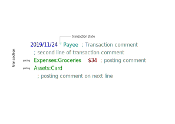

# Ledger

## Syntax



Basic transaction

```
2019/09/30 Restaurant
    Expenses:Dining                $25.00
    Liabilities:MasterCard
```

Setting transaction id

```
2019/09/30 (#12345) Restaurant
    Expenses:Dining                $25.00
    Liabilities:MasterCard
```

Posting and transaction notes

```
2019/09/30 Supermarket  ; First line of transaction note
    ; next line of transaction note
    Expenses:Groceries                $35.00  ; Individual posting note on same line
    Expenses:Cat:Food                 $15.00
      ; Invidual posting note on separate line
    Liabilities:MasterCard
```

Metadata: tags

```
2019/09/30 Restaurant
    Expenses:Dining                $25.00
    Liabilities:MasterCard  ; :TAG1:TAG2:
```

Metadata: key-value pairs

```
2019/09/30 Restaurant
    Expenses:Dining                $25.00
    Liabilities:MasterCard  ; Location: Moscow
```

Currency conversion

```
2019/09/30 Conversion
    Assets:EURCard      100 EUR
    Assets:USDCard      $-110.77
```

Balance assertion

```
2019/09/30 Restaurant
    Expenses:Dining                $25.00
    Assets:MasterCard         $-26.00 = $300
```

Balance assignment

```
2019/09/30 Restaurant
    Expenses:Dining                $25.00
    Assets:MasterCard         = $300
```

Resetting a balance

```
2019/09/30 Adjustment
    Assets:MasterCard         = $300
    Equity:Adjustments
```

## Reporting

## Links

* [Official site](https://www.ledger-cli.org/)
  * [Official docs](https://www.ledger-cli.org/3.0/doc/ledger3.html)
  * [Official ledger-mode docs](https://www.ledger-cli.org/3.0/doc/ledger-mode.html)
* [Basic cheatsheet at devhints.io](https://devhints.io/ledger)
* [plaintextaccounting.org](https://plaintextaccounting.org/)
